### 编程语言

* Java

### 开发环境

* Windows10
  * IDEA 2024.1
  * MySQL8

### 运行环境

* JDK 1.8 
* Node.js 18

### 主要技术

* 前端
  * Vue2 
  * Axios
  * element-ui
  * animate.css
* 后端
  * SpringBoot 2 
  * Mybatis Puls

### 如何运行

* 前端
  * 进入`myvue/`
  * `npm i`
  * `npm run dev`
* 后端
  * 使用 IDEA打开 `tutor`
    * Maven加载依赖
  * 数据库
    * 新建数据库`ssm`
    * 运行`tutor/src/sql/ssm.sql`
  * 配置
    * 修改`tutor/src/main/resources/application.yml`中的`username`和`password`
  * 启动后端

### 工作进展

第一轮迭代基本实现了Project的各项要求，包括：

1. 教师学生信息注册
2. 人员分类管理
3. 教师家教信息与学生家教需求的发布
4. 信息搜索分类查询
5. 用户评价反馈
6. 前后端数据库一致性管理

### 第二轮迭代预期工作

1. 第二轮迭代我们会尝试设计推荐匹配算法，为用户自动推荐需要的内容
2. 增加权限管理，对不同权限用户提供不同的操作环境
3. 美化UI，让系统更加美观便利

### 第一轮迭代项目界面展示

登录界面：

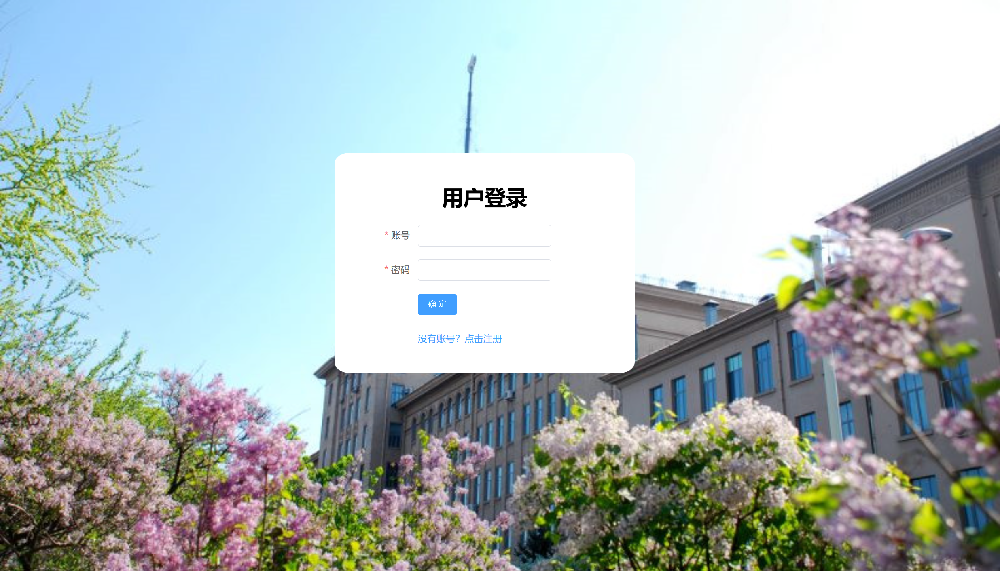

注册界面：

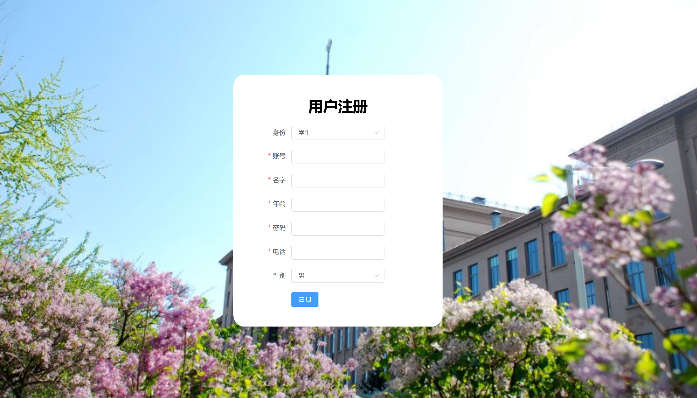

主页界面：

学生管理界面：

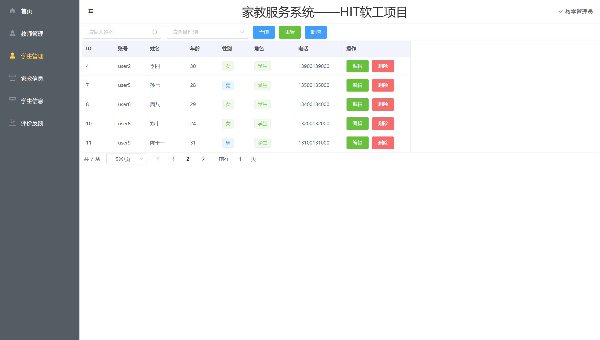

教师管理界面：

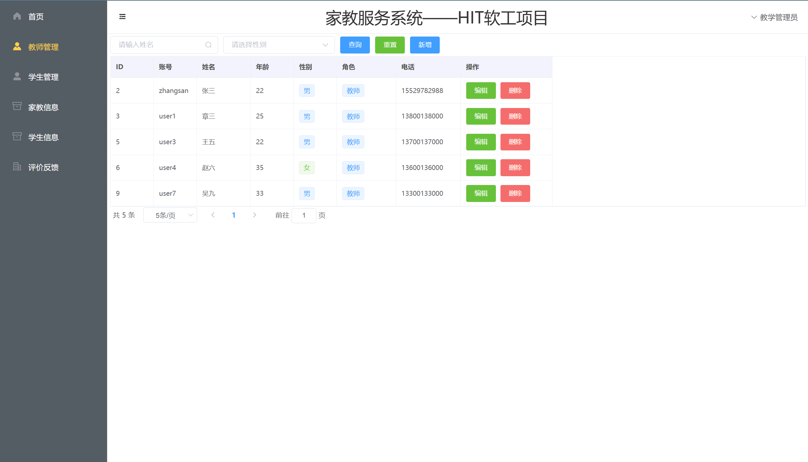

评价反馈界面：

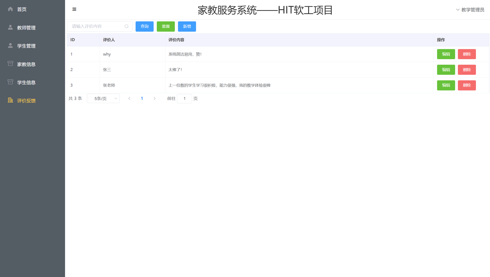

### 第二轮迭代工作进展
1. 丰富家教与学生的信息发布表，增加字段
2. 设计了推荐匹配算法，根据信息热度进行推荐匹配
3. 增加了权限管理，对不同权限用户提供不同的操作环境
4. 引入更加丰富的vue组件，美化UI，让系统更加直观便利
5. 完成Project要求的所有功能

### 第二轮迭代项目界面展示

教师权限管理界面：

管理员权限管理界面：

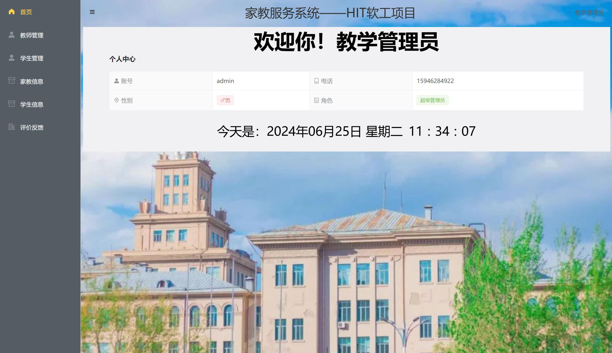

学生管理界面：

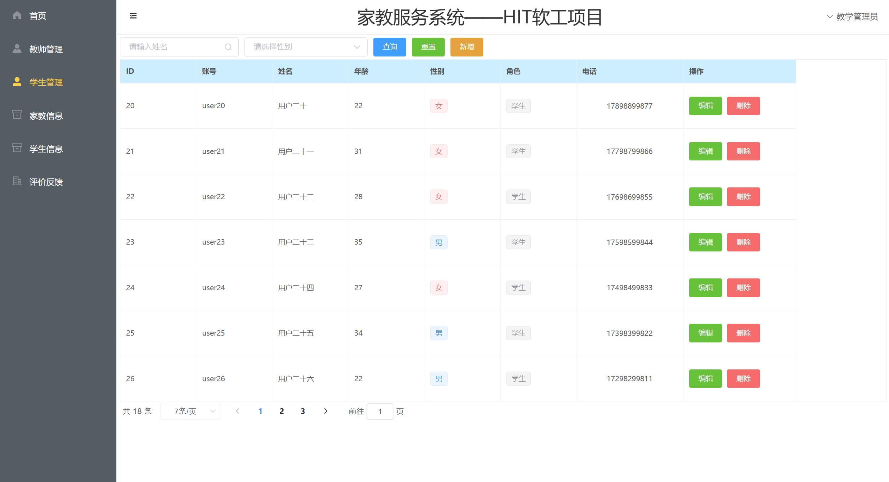

教师管理界面：

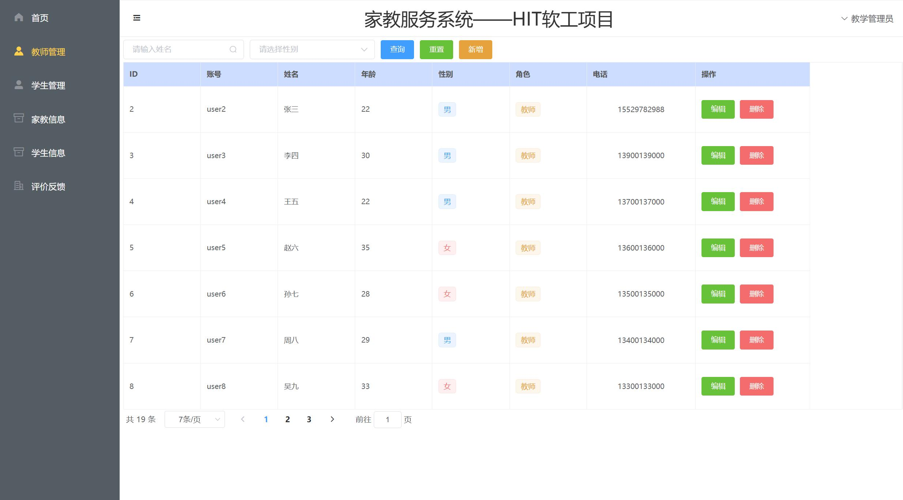

家教信息发布界面：

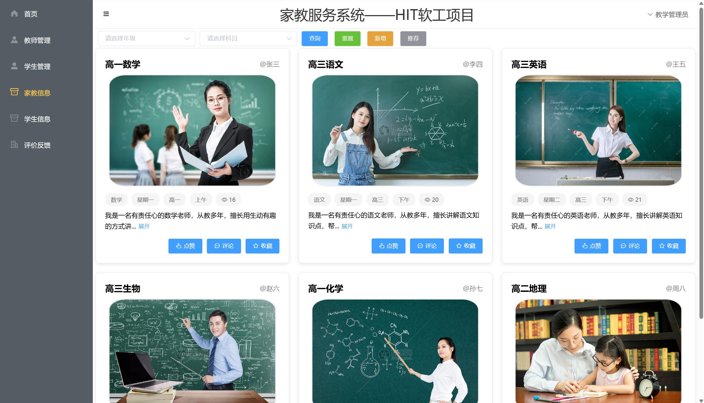

家教信息新增界面：

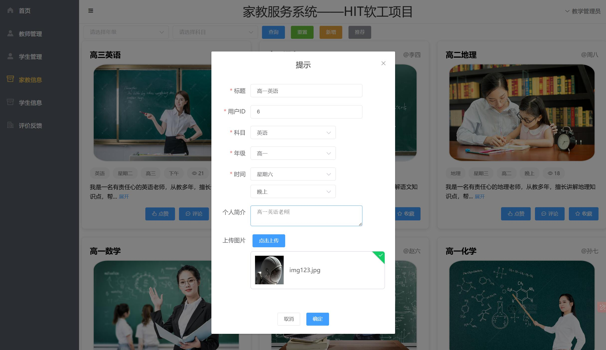

学生信息发布界面：

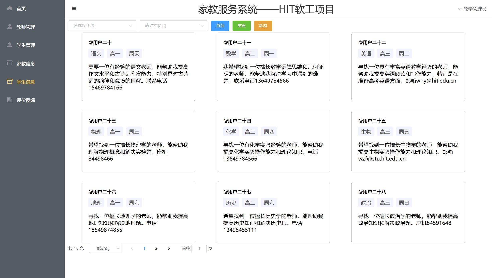

评价反馈界面：

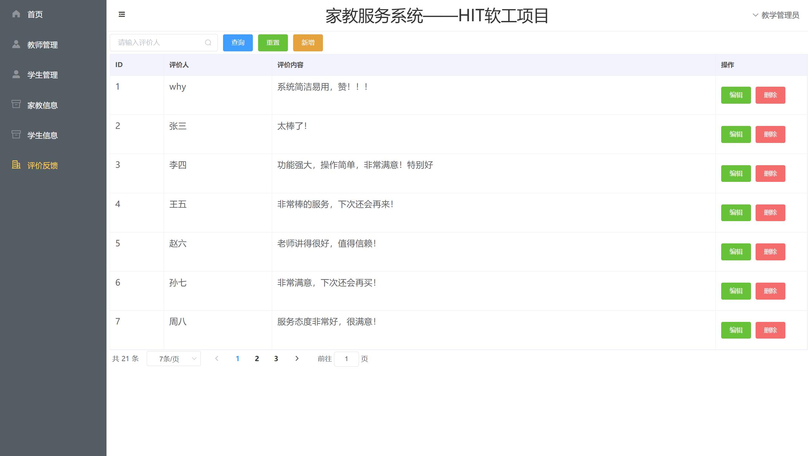